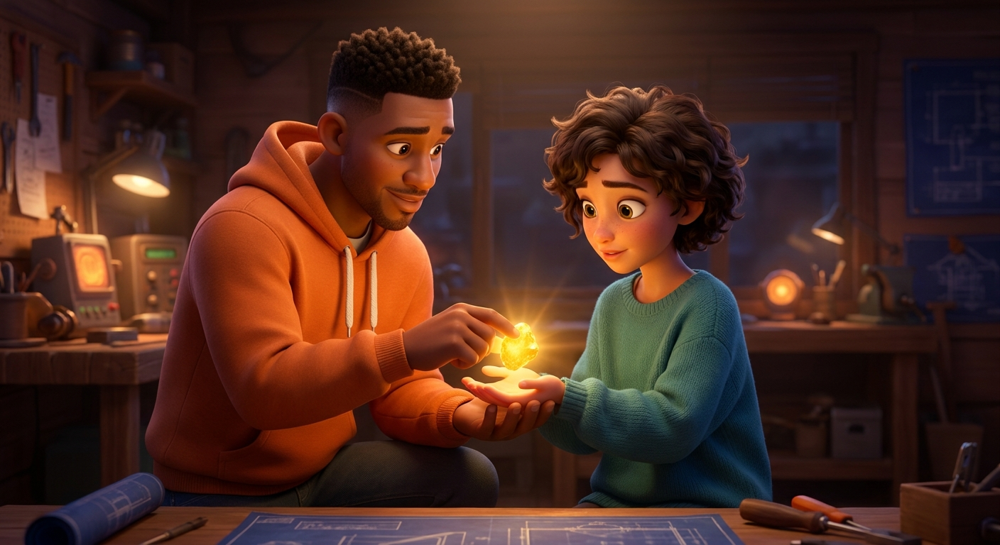
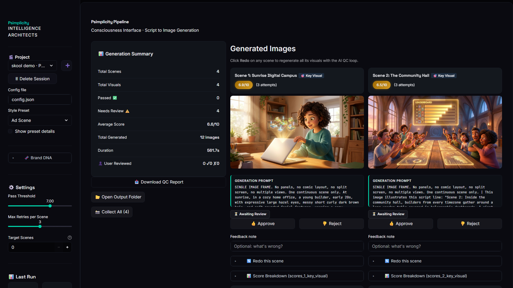
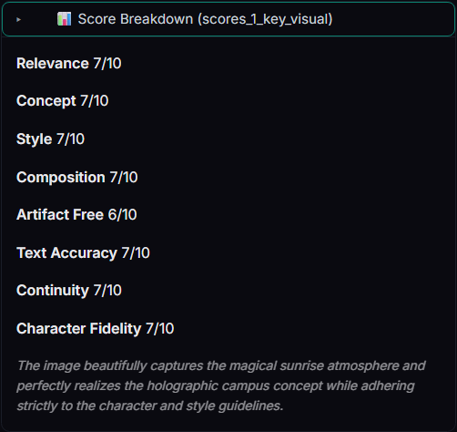
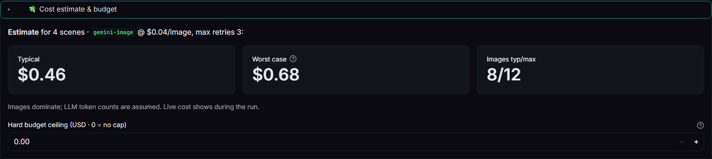

# Psimplicity 🧠✨

**Paste a script → get a directed, quality-controlled picture book.**

Psimplicity is an AI *Script → Image* pipeline with a built-in **AI Art Director**. It splits any script into scenes, generates a styled image for every scene, then **critiques each image on 8 dimensions** and automatically re-rolls the ones that don't pass — with targeted prompt surgery, not blind retries. You stay the boss: every frame gets 👍/👎 buttons, and your verdict overrides the critic.

<p align="center">
  
  <br/><em>A real output frame — generated, critiqued, and re-rolled automatically in one run.</em>
</p>

## What it does

```
your script ──▶ Parse (LLM splits it into scenes)
                  └─▶ Story Bible (shared characters, palette, world)
                        └─▶ for every scene:
                              Generate image ─▶ AI Art Director critique (8 scores)
                                   ▲                      │
                                   └── prompt surgery ◀── fail (< 7.0)
                              best attempt always kept ─▶ your 👍/👎 final say
```

- **8-dimension scoring** — relevance, concept, style, composition, artifact-free, text accuracy, continuity, character fidelity. Pass bar: 7.0/10.
- **Feedback that teaches** — approve/reject any frame; overrides are logged into the QC report next to the AI's scores.
- **Cost gate** — see the estimated $ *before* you generate, set a hard budget ceiling, watch live spend (LLM **and** image cost) during the run.
- **Multi-provider** — Gemini (Nano Banana / Imagen), OpenAI (GPT-Image, DALL·E), Seedream via OpenRouter; parser/critic on Gemini, GPT-4o, Claude, DeepSeek, Qwen, and more.
- **12 style presets** — Pixar/DreamWorks, Watercolor Storybook, Anime Epic, Noir Thriller, Cinematic Documentary, Retro Synthwave, and more. Plus a **Brand DNA** mode that extracts a visual identity from your own reference images.

| Results UI | Score breakdown | Cost gate |
|---|---|---|
|  |  |  |

**Real numbers** from the run in these screenshots: a 4-scene story → 12 images generated through the QC loop → **$0.55 total, ~9 minutes**, zero hand-editing.

## Install

You need **Python 3.10+** and one free API key.

### Windows (easiest)

1. [Download ZIP](https://github.com/psigho/psimplicity/archive/refs/heads/main.zip) or `git clone https://github.com/psigho/psimplicity.git`
2. Double-click **`engine/START.bat`** — it checks Python, asks for your API key, installs dependencies, and launches the app

### Any OS (manual)

```bash
git clone https://github.com/psigho/psimplicity.git
cd psimplicity/engine

# 1. environment
python -m venv .venv
# Windows: .venv\Scripts\activate    macOS/Linux: source .venv/bin/activate
pip install -r requirements.txt

# 2. keys — copy the template and paste at least ONE key
cp .env.example .env
#   GEMINI_API_KEY  → free at https://aistudio.google.com/apikey  (covers parser + critic + images)
#   OPENAI_API_KEY / OPENROUTER_API_KEY → optional extras

# 3. run
python -m streamlit run app.py
```

The app opens at `http://localhost:8501`.

## Quick start (60 seconds)

1. Click **➕** in the sidebar and name a project
2. Pick a **Style Preset** (try *Pixar / DreamWorks*) and set **Target Scenes** (0 = auto)
3. Open **💸 Cost estimate & budget** — check the estimate, set a ceiling if you want a hard cap
4. Paste your script and hit **🚀 Generate Images**
5. Review the gallery: open **📊 Score Breakdown** on any frame, 👍/👎 anything, **⚡ Regenerate** with extra direction, then **Collect Approved**

Every run is saved to `engine/output/run_<project>_<timestamp>/` with all attempts, finals, `qc_report.json` (full scores + your feedback) and `llm_calls.jsonl` (per-call cost telemetry).

## How much does it cost?

You bring your own API keys; Psimplicity shows you the price before and during every run. Ballpark with default settings (Gemini image engine at ~$0.04/image): **a 4-scene run ≈ $0.50–0.70**. The budget ceiling aborts a run gracefully if it ever crosses your number.

## Project layout

```
engine/            the app (Streamlit UI + pipeline modules)
  app.py           UI
  modules/         orchestrator, LLM gateway, art director, costing, providers…
  style_presets/   12 visual styles (JSON — add your own!)
  tests/           offline unit tests (pytest, no API spend)
  model_catalog.json, oga_models_reference.json   reference data (not loaded at runtime)
web/               optional marketing site (Vite/React) — not needed to run the app
```

## Add your own style

Drop a JSON into `engine/style_presets/`:

```json
{
  "name": "My Style",
  "art_style": "hand-painted gouache, thick brushstrokes",
  "color_palette": "warm terracotta, deep teal, cream highlights",
  "mood_keywords": ["cozy", "nostalgic", "soft light"]
}
```

It appears in the sidebar on next launch.

## Tests

```bash
cd engine
pip install -r requirements-dev.txt
pytest        # 45 offline tests — no API calls, no spend
```

## License

[MIT](LICENSE) — use it, fork it, ship with it. If you build something cool, share it back with the community. 🎓
